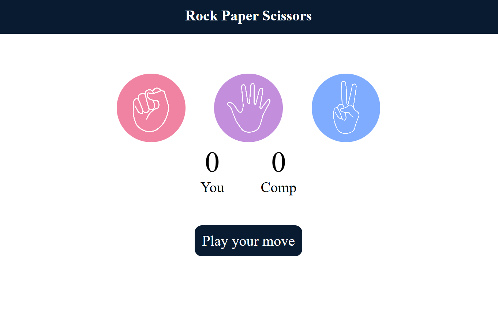

# Rock-Paper-Scissor 🎮

## 📌 Project Overview
Rock-Paper-Scissor is a fun and interactive web-based game built using **HTML, CSS, and JavaScript**.  
It allows players to compete against the computer in the classic Rock-Paper-Scissor challenge.  
The game updates scores in real time and provides a smooth, responsive experience.

---

## 🚀 Live Demo
🔗 [Play the Game Here](https://rock-paper-scissor-roan-seven.vercel.app/)

---

## ⚙️ Installation & Setup
Follow these steps to run the project locally:

1. **Clone the repository:**
   ```bash
   git clone https://github.com/RohitRajput021/Rock-Paper-Scissor.git
   ```
2. **Navigate to the project folder:**
   ```bash
   cd Rock-Paper-Scissor
   ```
3. **Open `index.html` in your browser to start playing.**

No additional dependencies are required!

---

## 🛠️ Technologies Used

- **HTML5** → Structure of the game  
- **CSS3** → Styling and layout  
- **JavaScript (ES6)** → Game logic and interactivity

---

## 🎮 How to Play

1. Choose one of the options: Rock ✊, Paper ✋, or Scissor ✌️
2. The computer randomly selects its move.
3. The winner is decided based on the classic rules:
    - Rock beats Scissor
    - Scissor beats Paper
    - Paper beats Rock
4. Scores are updated instantly.

---

## 📷 Screenshot



---

## 🤝 Contribution Guidelines

Contributions are welcome!  
If you’d like to contribute:

1. Fork the repository
2. Create a new branch (`feature-branch`)
3. Commit your changes
4. Push to your branch
5. Open a Pull Request

You can help by:
- Improving UI/UX
- Adding animations or sounds
- Extending gameplay (e.g., best of 3, difficulty levels)
- Fixing bugs or optimizing code

---

## 📜 License

This project is currently **unlicensed**.  
You are free to use and modify it for learning purposes.  
If you’d like to make it open source for others, adding an MIT License is recommended.

---

## ✨ Author

Developed by **Rohit Rajput**

---
